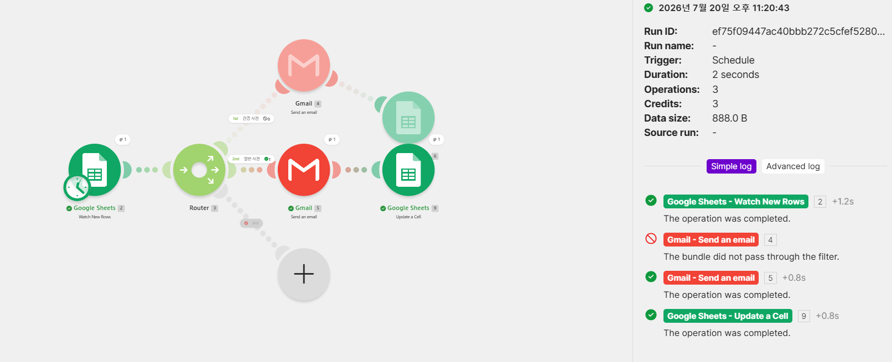
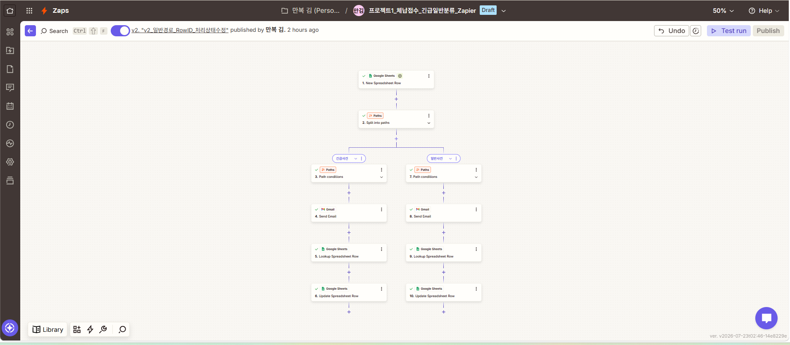
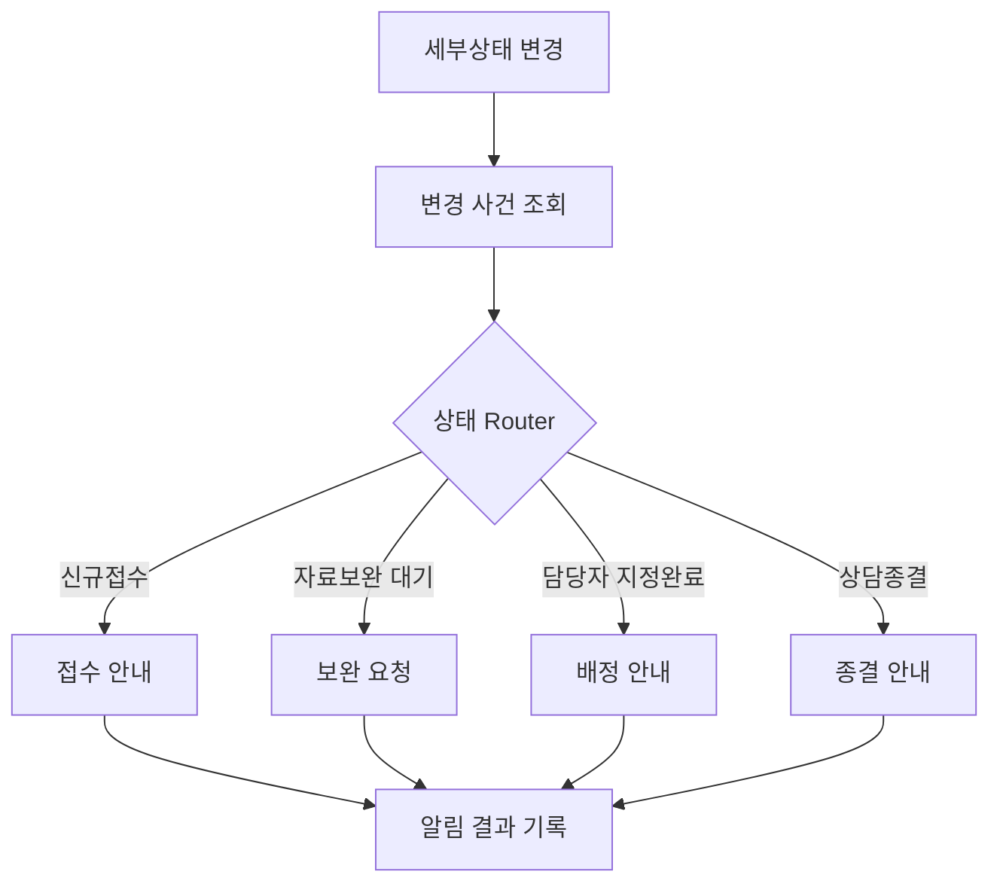

# Codyssey C1-3 · 노코드 업무 자동화

[](https://github.com/manbok2028/c1-3/actions/workflows/quality.yml)


> 반복되는 체납상담 접수·분류·알림·상태 기록을 Make와 Zapier로 자동화하고, 실행 증빙과 운영 지식을 1년 동안 축적하는 Codyssey 프로젝트입니다.

## 한눈에 보기

| 항목 | 내용 |
|---|---|
| 프로젝트 | 노코드 자동화 기초: 워크플로우 설계 |
| 자동화 대상 | 체납상담 신규 접수, 긴급도 분류, 이메일 알림, 처리상태 기록 |
| 비교 도구 | Make, Zapier |
| 연동 서비스 | Google Sheets, Gmail, AI by Zapier |
| 핵심 패턴 | Trigger → 조건 분기 → Action → 결과 기록 |
| 품질 관리 | 증빙 매니페스트, Python 검증 CLI, 단위 테스트, GitHub Actions |
| 운영 기간 | 1년 장기 유지보수 |

## 해결하려는 문제

기존 업무에서는 담당자가 Google Sheets의 신규 상담을 반복해서 확인하고, 긴급 여부를 판단해 이메일을 보낸 뒤 처리상태를 다시 기록해야 했습니다. 이 과정은 시간이 많이 들고 알림이나 상태 기록이 누락될 위험이 있습니다.

이 프로젝트는 반복 가능한 부분을 다음과 같이 자동화합니다.


세무적 판단과 실제 상담은 사람이 담당하고, 반복적인 감지·분류·알림·기록만 자동화하는 것을 원칙으로 합니다.

## 미션 진행 현황

| 범위 | 상태 | 검증 근거 |
|---|---|---|
| 프로젝트 1 · Make/Zapier 비교 구현 | ✅ 완료 | 전체 구성, 일반·긴급 분기, History, 이메일·Sheets 결과 |
| 프로젝트 2 · 상태 전환 자동화 | 🚧 설계 완료 | 상세 설계는 있으나 실제 Make 실행 증빙 필요 |
| 보너스 1 · 생성형 AI Action | ✅ 완료 | AI 생성 결과, 이메일, Sheets, History |
| 보너스 2 · 실패 알림·재시도 | ✅ 완료 | 실패 알림, 원인 분석, 수정 후 성공, 재시도 전략 |

전체 판정과 요구사항별 근거는 [미션 적합성 검토](docs/mission/compliance.md), 기준선은 [미션 요구사항](docs/mission/requirements.md)에서 관리합니다. 프로젝트 2의 실제 증빙이 추가되기 전에는 전체 미션을 완료로 표시하지 않습니다.

## 프로젝트 1 · 동일 워크플로우 비교

Make와 Zapier에서 같은 업무 흐름을 구현해 도구별 특성을 비교했습니다.

| 비교 항목 | Make | Zapier |
|---|---|---|
| 화면 구성 | 시각적 노드 연결 | 단계 중심 목록과 Paths |
| 조건 분기 | Router + Filter | Paths + 조건 규칙 |
| 구조 파악 | 복잡한 흐름을 한 화면에서 보기 쉬움 | 순차 실행을 따라가기 쉬움 |
| 실행 분석 | 모듈별 입출력과 실행 경로 확인 | Task별 실행 상세 확인 |
| 적합한 상황 | 다중 분기와 복잡한 데이터 흐름 | 빠른 구축과 단순한 순차 자동화 |

### Make 구현



- Trigger: Google Sheets `Watch New Rows`
- Branch: Router의 `긴급`, `일반` Filter
- Action 1: Gmail 이메일 발송
- Action 2: Google Sheets 처리상태 업데이트
- 자동 실행 근거: [Make History](evidence/project-1/make/Make02_History_자동실행성공.png)

### Zapier 구현



- Trigger: Google Sheets `New Spreadsheet Row`
- Branch: Paths의 `긴급`, `일반` 경로
- Action 1: Gmail 이메일 발송
- Action 2: Google Sheets 행 조회·업데이트
- 자동 실행 근거: [Zapier History](evidence/project-1/zapier/Zapier02_History_자동실행성공.png)

전체 실행 결과는 [`evidence/project-1/results`](evidence/project-1/results)에서 확인할 수 있습니다.

## 프로젝트 2 · 상태 전환 자동화

자유 주제 프로젝트는 사건의 세부상태가 바뀔 때 필요한 안내를 자동 발송하고 결과를 기록하는 Make 시나리오입니다.



현재 설계 문서는 구체화되어 있지만 실제 시나리오와 실행 화면이 없습니다. 다음 8종의 증빙을 확보하면 `evidence/manifest.toml`의 상태를 `complete`로 변경합니다.

1. 전체 Make 시나리오
2. 신규접수 실행 History
3. 자료보완 대기 실행 History
4. 담당자 지정완료 실행 History
5. 상담종결 실행 History
6. 동일 상태 재진입 시 중복 발송 차단
7. Gmail 실행 결과
8. Google Sheets 최종 상태

## 보너스 구현

### 생성형 AI Action

AI by Zapier를 사용해 상담내용 요약과 고객 안내문을 생성하고 기존 이메일·상태 기록 흐름에 연결했습니다.

- [AI 전체 구조](evidence/bonus/ai/BONUS1-01_AI_Action_전체구조.png)
- [AI 자동실행 History](evidence/bonus/ai/보너스1-05_AI자동실행_History성공.png)
- [상세 구현 기록](docs/archive/bonus-ai-detailed.md)

### 실패 알림과 재시도

잘못된 이메일 입력으로 발생한 실제 실패를 기반으로 탐지, 원인 분석, 수정, 재실행 성공 과정을 기록했습니다.

- [실패 알림 이메일](evidence/bonus/retry/보너스2-01_Zapier_실패알림메일.png)
- [수정 후 재실행 성공](evidence/bonus/retry/보너스2-03_오류수정후_재실행성공.png)
- [재시도 전략](evidence/bonus/retry/보너스2-04_재시도전략_설계.png)
- [상세 복구 기록](docs/archive/bonus-retry-detailed.md)

## 저장소 구조

```text
.
├─ .github/workflows/
│  └─ quality.yml              # main 푸시 시 자동 품질 검사
├─ docs/
│  ├─ architecture/            # 저장소 운영 규약
│  ├─ mission/                 # 요구사항과 적합성 판정
│  └─ archive/                 # 기존 상세 보고서 원문
├─ evidence/
│  ├─ project-1/               # Make, Zapier, 실행 결과
│  ├─ bonus/                   # AI와 장애 복구 증빙
│  └─ manifest.toml            # 요구사항별 증빙 목록
├─ src/codyssey_c1_3/          # 증빙 검증 Python 패키지
├─ tests/                      # 표준 unittest 테스트
├─ CHANGELOG.md
├─ CONTRIBUTING.md
├─ pyproject.toml
└─ README.md
```

구조와 명명 규칙은 [저장소 운영 규약](docs/architecture/repository.md)에 정의되어 있습니다. 기존 보고서는 삭제하지 않고 `docs/archive`에 보존합니다.

## 증빙 검증 도구

`evidence/manifest.toml`은 요구사항별 상태와 근거 파일을 연결합니다. Python CLI는 다음을 자동 검사합니다.

- 매니페스트 존재 여부
- 요구사항 ID 중복 여부
- 허용된 상태값 사용 여부
- 완료 항목의 증빙 존재 여부
- 등록된 증빙 파일의 실제 존재 여부와 확장자

### 실행 환경

- Python 3.11 이상
- 런타임 외부 의존성 없음
- Windows, macOS, Linux 지원

### PowerShell

```powershell
$env:PYTHONPATH = "src"
python -m codyssey_c1_3 validate
python -m unittest discover -s tests -v
```

### Bash

```bash
PYTHONPATH=src python -m codyssey_c1_3 validate
python -m unittest discover -s tests -v
```

성공 시 다음 결과가 출력됩니다.

```text
[OK] evidence manifest is consistent
```

같은 검사는 GitHub Actions의 `quality` 워크플로우에서도 실행됩니다.

## 증빙 추가 방법

1. 개인정보, 이메일, 토큰, API 키를 마스킹합니다.
2. 범위에 맞는 `evidence/` 하위 폴더에 이미지를 저장합니다.
3. `evidence/manifest.toml`에 요구사항 ID, 상태, 파일 경로를 등록합니다.
4. `docs/mission/compliance.md`의 판정을 갱신합니다.
5. 로컬 검증과 테스트를 실행합니다.
6. 검증이 통과하면 `main`에 커밋하고 직접 푸시합니다.

자세한 기여 절차는 [CONTRIBUTING.md](CONTRIBUTING.md)를 따릅니다.

## 1년 운영 원칙

- 사실과 증빙을 분리하지 않습니다.
- 실행하지 않은 기능을 완료로 표시하지 않습니다.
- 루트에는 진입 문서와 설정만 둡니다.
- 증빙 파일을 이동하면 매니페스트도 함께 수정합니다.
- 매 미션 종료 시 적합성 표와 변경 기록을 갱신합니다.
- 매월 깨진 링크, 누락 증빙, 민감정보 노출 여부를 확인합니다.
- 변경은 검증 후 `main`에 직접 반영합니다.

## 로드맵

- [x] 프로젝트 1 Make/Zapier 비교 구현
- [x] 일반·긴급 분기 실행 증빙
- [x] AI Action 보너스
- [x] 실패 알림과 재시도 보너스
- [x] 표준 저장소 구조와 자동 검증
- [ ] 프로젝트 2 Make 시나리오 실제 구현
- [ ] 프로젝트 2의 4개 상태 분기 실행 증빙
- [ ] 중복 발송 차단 검증
- [ ] 프로젝트 2 완료 후 전체 미션 상태 갱신

## 관련 문서

- [미션 요구사항](docs/mission/requirements.md)
- [미션 적합성 검토](docs/mission/compliance.md)
- [저장소 운영 규약](docs/architecture/repository.md)
- [프로젝트 1 상세 보고서](docs/archive/project-1-detailed.md)
- [전체 미션 설계 초안](docs/archive/mission-draft.md)
- [변경 기록](CHANGELOG.md)
- [기여 가이드](CONTRIBUTING.md)
