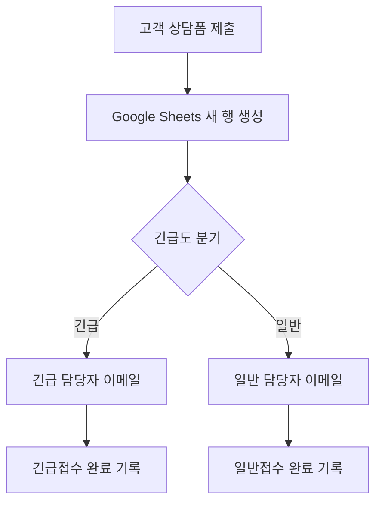
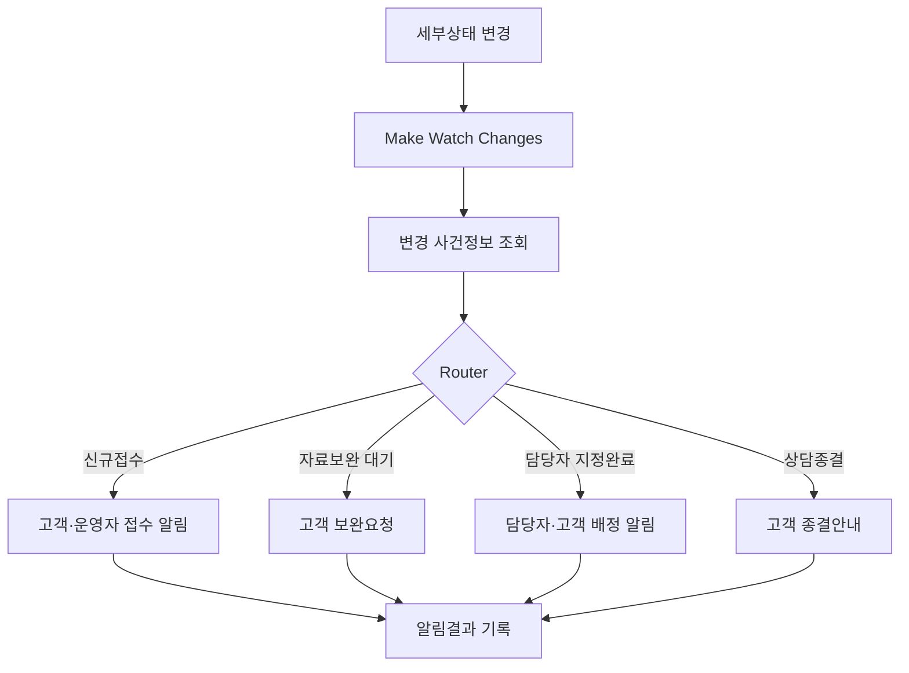

# 노코드 자동화 기초: 체납관리 워크플로우 설계 및 구현

> 제출 전 확인: 이 문서는 완성형 예시 보고서이다. `[실제 캡처 삽입]` 부분은 본인의 Make·Zapier 실행 화면으로 교체하고, 실행일시와 성공 여부도 실제 History에 맞게 수정해야 한다.

## 1. 미션 개요

본 프로젝트는 체납상담 과정에서 반복되는 접수 확인, 긴급도 분류, 담당자 알림, 고객 안내 및 처리상태 기록을 노코드 자동화로 구현하는 것을 목적으로 한다.

자동화 대상 업무는 다음과 같다.

`고객 접수 → 운영자 분류 → 담당자 배정 → 고객 상담 → 사건 종결`

전문적인 체납 유형 판단과 상담은 사람이 수행하고, 반복적인 알림과 상태 기록은 자동화한다.

---

# 프로젝트 1. Make와 Zapier 비교 구현

## 2. 동일 워크플로우 정의

### 2.1 프로젝트명

체납상담 신규접수 자동 분류 및 알림

### 2.2 사용 도구

- Google Forms: 고객 상담 접수
- Google Sheets: 접수정보 및 처리결과 저장
- Gmail: 담당자 알림
- Make: 비교 자동화 도구 1
- Zapier: 비교 자동화 도구 2

### 2.3 워크플로우



### 2.4 Trigger와 Action

| 구분 | 설정 |
|---|---|
| Trigger | Google Sheets에 새로운 접수 행 생성 |
| 긴급 Filter | 긴급도 = 긴급 |
| 긴급 Action 1 | 긴급 담당자에게 Gmail 발송 |
| 긴급 Action 2 | Sheets 처리상태 업데이트 |
| 일반 Filter | 긴급도 = 일반 또는 우선 |
| 일반 Action 1 | 일반 담당자에게 Gmail 발송 |
| 일반 Action 2 | Sheets 처리상태 업데이트 |

Trigger는 자동화를 시작하는 사건이고, Action은 Trigger 발생 후 실행되는 처리이다. Filter는 입력값이 정해진 조건에 맞는지 판단하여 적합한 경로만 통과시킨다.

## 3. 테스트 데이터

실제 고객정보 대신 다음 가상자료를 사용하였다.

| 테스트번호 | 접수번호 | 고객명 | 긴급도 | 압류 여부 | 예상 경로 |
|---|---|---|---|---|---|
| P1-TC-01 | P1-MAKE-URGENT-001 | 홍길동 | 긴급 | 압류 진행 | 긴급 |
| P1-TC-02 | P1-MAKE-NORMAL-001 | 김가상 | 일반 | 해당 없음 | 일반 |
| P1-TC-03 | P1-ZAP-URGENT-001 | 이테스트 | 긴급 | 압류 진행 | 긴급 |
| P1-TC-04 | P1-ZAP-NORMAL-001 | 박가상 | 일반 | 해당 없음 | 일반 |

---

## 4. Make 구현

### 4.1 구성

`Google Sheets – Watch New Rows → Router → Gmail – Send an Email → Google Sheets – Update a Row`

### 4.2 긴급 경로

Filter 조건:

```text
긴급도 = 긴급
```

이메일 제목:

```text
[긴급 체납상담] 신규사건 접수 – {{접수번호}}
```

처리상태:

```text
긴급접수 알림완료
```

#### 구성 화면

> [실제 캡처 삽입: P1_Make_01_전체시나리오.png]

> [실제 캡처 삽입: P1_Make_02_긴급Filter.png]

### 4.3 일반 경로

Filter 조건:

```text
긴급도 = 일반 OR 긴급도 = 우선
```

처리상태:

```text
일반접수 알림완료
```

#### 구성 화면

> [실제 캡처 삽입: P1_Make_03_일반Filter.png]

### 4.4 Make 실행 결과 예시

> 아래 결과는 작성 형식을 보여주는 예시이다. 실제 History를 확인한 후 일시와 결과를 교체한다.

| 테스트번호 | 입력 | 실행 경로 | Gmail | Sheets | History | 최종 결과 |
|---|---|---|---|---|---|---|
| P1-TC-01 | 긴급 | 긴급 | 수신 예시 | 긴급접수 알림완료 예시 | Success 예시 | 실제 실행 후 기재 |
| P1-TC-02 | 일반 | 일반 | 수신 예시 | 일반접수 알림완료 예시 | Success 예시 | 실제 실행 후 기재 |

#### 실행 증빙

> [실제 캡처 삽입: P1_Make_04_긴급경로_History.png]

> [실제 캡처 삽입: P1_Make_05_긴급이메일.png]

> [실제 캡처 삽입: P1_Make_06_긴급시트결과.png]

> [실제 캡처 삽입: P1_Make_07_일반경로_History.png]

> [실제 캡처 삽입: P1_Make_08_일반이메일.png]

> [실제 캡처 삽입: P1_Make_09_일반시트결과.png]

---

## 5. Zapier 구현

### 5.1 구성

`Google Sheets – New Spreadsheet Row → Paths → Gmail – Send Email → Google Sheets – Update Spreadsheet Row`

### 5.2 Path A: 긴급

```text
긴급도 Exactly matches 긴급
```

Action:

1. 긴급 담당자 이메일 발송
2. 처리상태를 `긴급접수 알림완료`로 변경

### 5.3 Path B: 일반

```text
긴급도 Exactly matches 일반
```

Action:

1. 일반 담당자 이메일 발송
2. 처리상태를 `일반접수 알림완료`로 변경

#### 구성 화면

> [실제 캡처 삽입: P1_Zapier_01_전체Zap.png]

> [실제 캡처 삽입: P1_Zapier_02_긴급Path.png]

> [실제 캡처 삽입: P1_Zapier_03_일반Path.png]

### 5.4 Zapier 실행 결과 예시

| 테스트번호 | 입력 | 실행 Path | Gmail | Sheets | Zap History | 최종 결과 |
|---|---|---|---|---|---|---|
| P1-TC-03 | 긴급 | Path A | 수신 예시 | 긴급접수 알림완료 예시 | Success 예시 | 실제 실행 후 기재 |
| P1-TC-04 | 일반 | Path B | 수신 예시 | 일반접수 알림완료 예시 | Success 예시 | 실제 실행 후 기재 |

#### 실행 증빙

> [실제 캡처 삽입: P1_Zapier_04_긴급Path_History.png]

> [실제 캡처 삽입: P1_Zapier_05_긴급결과.png]

> [실제 캡처 삽입: P1_Zapier_06_일반Path_History.png]

> [실제 캡처 삽입: P1_Zapier_07_일반결과.png]

---

## 6. Make와 Zapier 비교 분석

| 비교 항목 | Make | Zapier |
|---|---|---|
| UI·UX | 시각적 노드와 연결선 중심 | 단계별 목록 중심 |
| 설정 난이도 | Mapping과 Bundle 개념 학습 필요 | 순차적 설정으로 비교적 직관적 |
| 조건 분기 | Router와 Filter 사용 | Paths와 Filter 사용 |
| 복잡한 흐름 | 다중 분기와 데이터 처리에 유리 | 단순 연결과 빠른 구축에 유리 |
| 데이터 매핑 | 모듈별 세부 데이터 확인 가능 | 필드 선택 방식이 간단함 |
| 실행 로그 | History에서 모듈별 입출력 확인 | Zap History에서 단계별 확인 |
| 무료 플랜 | 복잡한 실습에 상대적으로 유리 | 멀티스텝·Paths 제한 확인 필요 |
| 오류 분석 | 실패 모듈과 Bundle 확인이 상세함 | 실패 단계와 메시지 확인이 쉬움 |
| 유지관리 | 복잡한 시나리오를 한눈에 파악 가능 | 긴 Zap은 단계가 길어질 수 있음 |
| 적합한 업무 | 상태관리·복잡한 분기 업무 | 단순 앱 연결·신속한 자동화 |

### 6.1 Make 장점과 단점

장점:

- 전체 자동화 흐름을 시각적으로 확인할 수 있다.
- Router를 이용한 다중 조건 분기가 명확하다.
- 체납관리처럼 상태가 여러 단계로 변하는 업무에 적합하다.
- 실행된 데이터의 입출력을 모듈 단위로 점검할 수 있다.

단점:

- 처음에는 Mapping과 Bundle 개념이 어렵다.
- 모듈이 많아지면 시나리오가 복잡해질 수 있다.
- 실행 모듈 수에 따른 크레딧 관리가 필요하다.

### 6.2 Zapier 장점과 단점

장점:

- Trigger와 Action을 순서대로 설정하기 쉽다.
- 단순한 자동화를 빠르게 만들 수 있다.
- 초보자가 자동화의 기본 구조를 이해하기 좋다.

단점:

- 복잡한 조건 분기는 Paths 기능에 의존한다.
- 멀티스텝과 Paths 사용 시 플랜 제한이 발생할 수 있다.
- 복잡한 상태관리에서는 전체 흐름 파악이 어려울 수 있다.

### 6.3 도구 선정 의견

단순한 신규접수 알림에는 Zapier가 편리하지만, 접수·분류·배정·상담·종결과 같이 여러 상태와 예외 경로를 관리해야 하는 체납관리 업무에는 Make가 더 적합하다고 판단하였다.

---

# 프로젝트 2. 체납관리 상태 전환 자동화

## 7. 반복 업무 정의

운영자 또는 담당자가 사건의 세부상태를 변경할 때마다 고객과 담당자에게 필요한 이메일을 발송하고, 발송 결과를 Google Sheets에 기록하는 업무를 자동화한다.

## 8. 도구 선정

Make를 선정하였다. Router를 이용해 여러 상태를 한 시나리오에서 분기할 수 있고, Google Sheets의 셀 변경을 Trigger로 사용하며, 각 단계의 실행 결과를 상세하게 확인할 수 있기 때문이다.

## 9. 상태 체계

| 기본상태 | 세부상태 |
|---|---|
| 접수 | 신규접수, 자료확인 중, 자료보완 대기 |
| 분류 | 유형분류 중, 분류완료 |
| 배정 | 담당자 지정 대기, 담당자 지정완료 |
| 상담 | 최초 연락 대기, 상담 진행 중, 고객회신 대기, 후속조치 중 |
| 종결 | 처리완료, 상담종결, 접수취소 |

## 10. 자동화 흐름



## 11. 세부 분기

### 11.1 신규접수

Filter:

```text
세부상태 = 신규접수 AND 최종알림상태 ≠ 신규접수
```

Action:

1. 고객 접수완료 이메일
2. 운영자 신규접수 이메일
3. Sheets 알림처리상태 업데이트

### 11.2 자료보완 대기

Filter:

```text
세부상태 = 자료보완 대기
AND 필요자료가 존재함
AND 최종알림상태 ≠ 자료보완 대기
```

Action:

1. 고객 자료보완 요청 이메일
2. Sheets 알림처리상태 업데이트

### 11.3 담당자 지정완료

Filter:

```text
세부상태 = 담당자 지정완료
AND 담당자가 존재함
AND 담당자이메일이 존재함
AND 최종알림상태 ≠ 담당자 지정완료
```

Action:

1. 담당자 사건배정 이메일
2. 고객 담당자배정 이메일
3. Sheets 알림처리상태 업데이트

### 11.4 상담종결

Filter:

```text
세부상태 = 상담종결
AND 상담결과가 존재함
AND 종결 사유가 존재함
AND 종결일시가 존재함
AND 최종알림상태 ≠ 상담종결
```

Action:

1. 고객 상담종결 이메일
2. Sheets 알림처리상태 업데이트

## 12. 프로젝트 2 실행 결과 예시

> 다음 표는 실제 실행 결과를 기록할 형식이다. 실제 Make History와 Gmail·Sheets 결과를 확인해 수정한다.

| 테스트번호 | 세부상태 | 예상 결과 | History 예시 | 최종 결과 |
|---|---|---|---|---|
| P2-TC-01 | 신규접수 | 고객·운영자 알림 및 상태기록 | Success 예시 | 실제 실행 후 기재 |
| P2-TC-02 | 자료보완 대기 | 고객 보완요청 및 상태기록 | Success 예시 | 실제 실행 후 기재 |
| P2-TC-03 | 담당자 지정완료 | 담당자·고객 알림 및 상태기록 | Success 예시 | 실제 실행 후 기재 |
| P2-TC-04 | 상담종결 | 고객 종결안내 및 상태기록 | Success 예시 | 실제 실행 후 기재 |
| P2-TC-05 | 담당자 이메일 누락 | Filter 차단 | Incomplete/Filtered 예시 | 실제 실행 후 기재 |
| P2-TC-06 | 동일 상태 재진입 | 중복발송 차단 | Filtered 예시 | 실제 실행 후 기재 |

## 13. 프로젝트 2 실행 증빙

> [실제 캡처 삽입: P2_Make_01_전체시나리오.png]

> [실제 캡처 삽입: P2_Make_02_신규접수_History.png]

> [실제 캡처 삽입: P2_Make_03_자료보완_History.png]

> [실제 캡처 삽입: P2_Make_04_담당자배정_History.png]

> [실제 캡처 삽입: P2_Make_05_상담종결_History.png]

> [실제 캡처 삽입: P2_Make_06_중복발송차단.png]

> [실제 캡처 삽입: P2_Make_07_Gmail결과.png]

> [실제 캡처 삽입: P2_Make_08_Sheets최종결과.png]

---

# 보너스 설계

## 14. AI 연동

고객 상담내용을 생성형 AI가 다음 형식으로 요약하도록 확장할 수 있다.

1. 체납기관
2. 체납 유형 추정
3. 압류·공매 여부
4. 긴급도 추천
5. 추가 확인사항
6. 담당자 확인용 요약

AI 결과는 참고자료로만 사용하고, 운영자가 체납 유형과 긴급도를 최종 확정한다. 주민등록번호, 인증정보 등 민감정보는 외부 AI로 전달하지 않는다.

## 15. 실패 알림 및 재시도

이메일 발송 또는 Sheets 업데이트 실패 시 다음과 같이 처리한다.

- 운영자에게 오류 이메일 발송
- 알림처리상태를 `실패`로 기록
- 오류내용 열에 메시지 기록
- Gmail 일시 오류는 History에서 재실행
- Sheets 저장 실패는 오류대기 시트에 임시 적재
- 성공한 경우에만 최종알림상태 기록

---

# 보안 및 개인정보 보호

## 16. 제출물 보안

- 고객명은 가명 사용
- 전화번호는 `010-****-1234` 형식으로 마스킹
- 계정 이메일 일부 마스킹
- API Key, 토큰, 비밀번호 노출 금지
- Make·Zapier 연결정보 가림 처리
- 실제 체납금액과 관할기관 정보 사용 금지
- 주민등록번호, 공동인증서, 홈택스 비밀번호 수집 금지

---

# 최종 검증표

## 17. 프로젝트 1

| 확인사항 | Make | Zapier |
|---|---:|---:|
| 자동화 활성화 상태에서 실행 | □ | □ |
| 긴급 경로 실제 실행 | □ | □ |
| 일반 경로 실제 실행 | □ | □ |
| Gmail 실제 수신 | □ | □ |
| Sheets 처리상태 변경 | □ | □ |
| History 성공 캡처 | □ | □ |
| 계정정보 마스킹 | □ | □ |

## 18. 프로젝트 2

| 확인사항 | 완료 |
|---|---:|
| 신규접수 경로 실행 | □ |
| 자료보완 경로 실행 | □ |
| 담당자 지정완료 경로 실행 | □ |
| 상담종결 경로 실행 | □ |
| 누락정보 Filter 차단 | □ |
| 중복발송 차단 | □ |
| Gmail 결과 캡처 | □ |
| Sheets 결과 캡처 | □ |
| Make History 캡처 | □ |

---

# 결론

본 프로젝트를 통해 Trigger가 자동화를 시작하는 사건이고, Action이 실제 처리 동작이며, Filter와 Router가 입력조건에 따라 경로를 결정한다는 점을 확인할 수 있다.

Make는 복잡한 분기와 상태관리 업무에 유리하고, Zapier는 단순한 앱 연결을 빠르게 구축하는 데 유리하다. 체납관리 업무는 접수·분류·배정·상담·종결의 여러 상태와 예외 처리가 필요하므로, 최종 자동화 도구로 Make를 선정하였다.

실제 운영 단계에서는 개인정보 보호, 접근권한, 변경이력, 이메일 오발송 방지 및 자료 보관·파기 정책을 추가로 검토해야 한다.